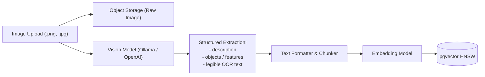

# AI & Multimodal Capabilities

Ponup integrates state-of-the-art vision analysis, LLM content drafting, and semantic embedding pipelines that work with local open-weight models (via Ollama or SentenceTransformers) as well as hosted OpenAI-compatible APIs.

---

## Multimodal Image Analysis

When image files (`.png`, `.jpg`, `.jpeg`, `.webp`, etc.) are uploaded to a space, Ponup stores the pristine binary image in object storage while optionally performing structured vision extraction.



### Extracted Image Metadata

The vision pipeline extracts three key dimensions formatted into JSON:
- **`description`**: A concise, factual summary of the image.
- **`objects`**: An array of identifiable objects, people, landmarks, or visual features.
- **`text`**: All legible text found in the image (preserving line breaks).

This extracted text is automatically combined and indexed into pgvector chunks so users and agents can find images via semantic queries (e.g., searching *"server network diagram with high availability"* will find an uploaded infrastructure diagram).

### Vision Configuration Recipes

=== "Local Ollama (e.g., LLaVA or Llama 3.2 Vision)"
    First pull your preferred vision model:
    ```bash
    ollama pull llava
    # or: ollama pull llama3.2-vision
    ```

    Configure `.env`:
    ```dotenv
    IMAGE_ANALYSIS_PROVIDER=ollama
    IMAGE_ANALYSIS_BASE_URL=http://host.docker.internal:11434
    IMAGE_ANALYSIS_MODEL=llava
    IMAGE_ANALYSIS_TIMEOUT_SECONDS=120
    ```

=== "Hosted / OpenAI-Compatible (OpenAI, OpenRouter, Groq)"
    Configure `.env`:
    ```dotenv
    IMAGE_ANALYSIS_PROVIDER=openai-compatible
    IMAGE_ANALYSIS_BASE_URL=https://api.openai.com/v1
    IMAGE_ANALYSIS_MODEL=gpt-4o-mini
    IMAGE_ANALYSIS_API_KEY=sk-...
    IMAGE_ANALYSIS_TIMEOUT_SECONDS=120
    ```

---

## AI-Assisted Content Drafting

When creating content, users can click **Generate with AI** to draft polished Markdown or valid JSON based on the Title, Description, and Tags.

### Drafting Configuration Recipes

=== "Local Ollama"
    Pull a model:
    ```bash
    ollama pull llama3.2
    ```

    Configure `.env`:
    ```dotenv
    LLM_BASE_URL=http://host.docker.internal:11434/v1
    LLM_MODEL=llama3.2
    LLM_TIMEOUT_SECONDS=60
    ```

=== "OpenAI / OpenRouter"
    Configure `.env`:
    ```dotenv
    LLM_BASE_URL=https://api.openai.com/v1
    LLM_MODEL=gpt-4o-mini
    LLM_API_KEY=sk-...
    LLM_TIMEOUT_SECONDS=60
    ```

---

## Vector Embedding Providers

Ponup supports local on-premise embeddings or external OpenAI-compatible embedding APIs.

### Embedding Configuration

=== "Local Provider (Default)"
    Runs inside the container using HuggingFace `sentence-transformers`:

    ```dotenv
    EMBEDDING_PROVIDER=local
    EMBEDDING_MODEL=sentence-transformers/all-MiniLM-L6-v2
    EMBEDDING_DIMENSIONS=384
    ```

=== "OpenAI-Compatible Embeddings"
    Use hosted vector embeddings (such as OpenAI, Voyage AI, or TEI):

    ```dotenv
    EMBEDDING_PROVIDER=openai-compatible
    OPENAI_COMPATIBLE_BASE_URL=https://api.openai.com/v1
    OPENAI_COMPATIBLE_API_KEY=sk-...
    OPENAI_COMPATIBLE_MODEL=text-embedding-3-small
    EMBEDDING_DIMENSIONS=1536
    ```

!!! warning "Vector Dimension Matching"
    The `EMBEDDING_DIMENSIONS` setting must match the exact output vector dimension of your chosen embedding model. If you change models or dimensions on an existing database, existing vector columns and embeddings will need to be migrated.
