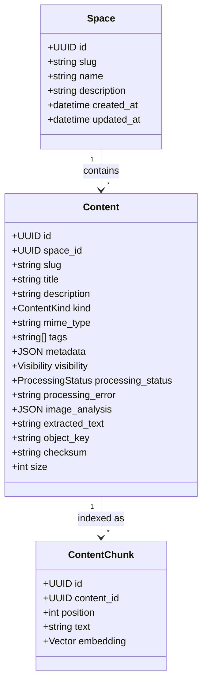
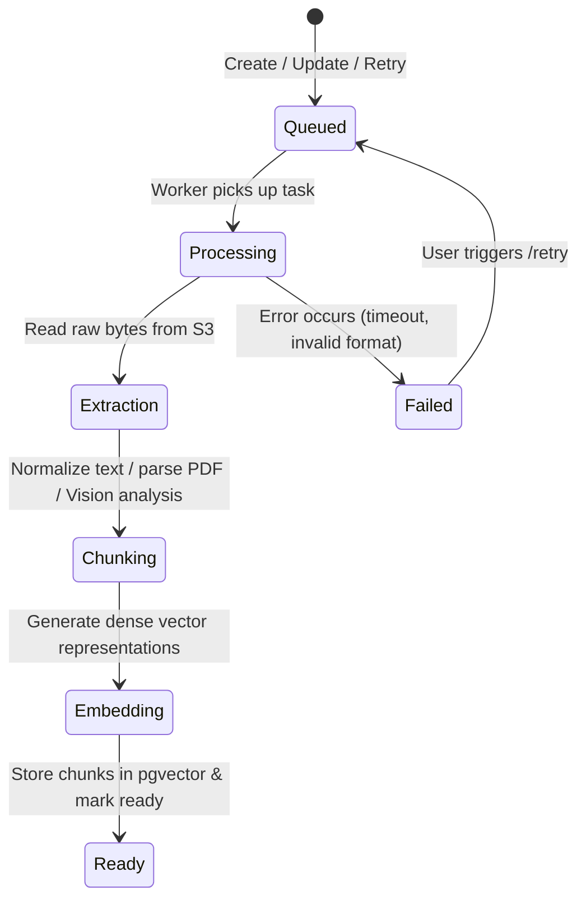

# Core Concepts

Understanding the core entities, processing lifecycle, and search mechanisms behind Ponup.

---

## Spaces

A **Space** is an isolated container for knowledge, documents, and assets. You can create spaces for different projects, departments, clients, or agent context boundaries.

### Key Space Attributes
- **UUID (`id`)**: Immutable unique identifier.
- **Slug (`slug`)**: URL-safe, unique identifier (e.g. `product-roadmap`). Slugs are automatically generated from the space name if not explicitly specified, with collision handling (e.g. `product-roadmap-2`).
- **Name (`name`)**: Display title.
- **Description (`description`)**: Contextual explanation of what the space contains.
- **Cascading Deletion**: Deleting a space permanently deletes all its associated contents, raw object storage files, chunks, and embeddings.

---

## Content

**Content** represents individual items stored within a Space.

### Content Kinds (`ContentKind`)

1. **`markdown` (`text/markdown`)**:
   - Authored text documents.
   - Fully extracted, chunked, and embedded into vector search.
   - Edited directly via web UI or API.

2. **`json` (`application/json`)**:
   - Structured JSON objects or arrays.
   - Formatted cleanly and indexed as searchable text chunks.
   - Retains JSON structure when requested via API or MCP resources.

3. **`file` (`application/octet-stream`, `application/pdf`, `text/plain`, `image/*`)**:
   - Uploaded binary or text files stored in S3/RustFS.
   - **PDFs**: Extracted into clean text per-page, then chunked and embedded.
   - **Plain text**: Directly chunked and embedded.
   - **Images**: Retains original blob; if vision analysis is enabled, factual descriptions, objects, and extracted OCR text are embedded into vector search.

### Visibility Modes

- **`private` (Default)**: Accessible only through authenticated administrative interfaces (or local admin network).
- **`public`**: Accessible anonymously via `/p/{space_slug}/{content_slug}` and the `/public/v1/...` REST API routes.

---

## Ingestion & Processing Pipeline

When content is created, uploaded, or updated, it is queued for asynchronous processing by Celery workers.

### Processing Status Lifecycle (`ProcessingStatus`)

- **`queued`**: Item is registered and waiting for an available background worker.
- **`processing`**: Worker is extracting text, executing vision analysis (if applicable), chunking, and calculating embeddings.
- **`ready`**: Processing complete. All chunks and embeddings are indexed in PostgreSQL with `pgvector` and available for semantic search.
- **`failed`**: An error occurred. The specific error message is stored in `processing_error` and displayed in the UI. Users can trigger a retry via the web UI, REST API (`/retry`), or MCP tool.

### Semantic Chunking Strategy

Ponup splits extracted text into contextual chunks using paragraph-aware chunking:
- **Target chunk size**: ~3,200 characters (~800 tokens).
- **Overlap**: ~400 characters (~100 tokens) to ensure context continuity across chunk boundaries.
- **Boundary preservation**: Chunks break at double newline (`\n\n`) boundaries whenever possible rather than splitting words or sentences in half.

---

## Semantic Vector Search

Ponup uses PostgreSQL with the **`pgvector`** extension and an **HNSW** (Hierarchical Navigable Small World) index configured for cosine distance (`vector_cosine_ops`):

$$\text{score} = \max(0.0, 1.0 - \text{cosine\_distance})$$

### Search Features:
- **Natural Language Matching**: Match query semantics rather than exact keyword substrings.
- **Space Scoping**: Queries are scoped to a specific Space.
- **Tag Filtering**: Filter results to only include Content containing specific tags.
- **Top-K Ranking**: Configurable result limit (between 1 and 50 chunks, default 10).
- **Passage-level Granularity**: Returns the exact matching text chunk along with its position, score, and parent content metadata.
