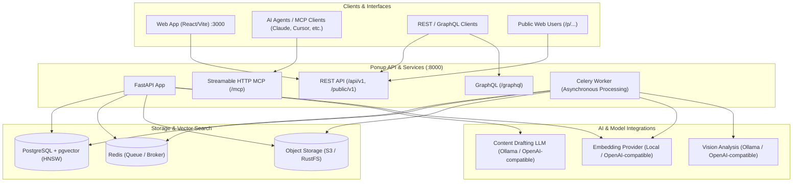

# Ponup

**Context engineering and content management for humans and AI.**

Ponup stores authored and uploaded content in **Spaces**, makes it instantly searchable via semantic embeddings, and serves it seamlessly to people and AI agents through a modern Web App, REST API, GraphQL, Model Context Protocol (MCP), and public links.

---

## Why Ponup?

AI agents require accurate, structured, and fast contextual grounding. Human teams require intuitive knowledge organization, rich previews, and easy collaboration. Ponup bridges this gap:

- **Unified Knowledge Store**: Manage Markdown documents, structured JSON records, PDFs, plain text, and images within isolated **Spaces**.
- **Agent-Ready with MCP**: Built-in [Model Context Protocol (MCP)](mcp.md) endpoint over Streamable HTTP (`/mcp`), enabling agents like Claude Desktop, Cursor, and custom tools to discover, read, update, and semantically search content.
- **Multimodal Ingestion**: Preserves original image and document uploads while automatically extracting structured descriptions, detected objects, and legible text via vision models.
- **Semantic Vector Search**: High-performance semantic retrieval powered by PostgreSQL and `pgvector` with HNSW cosine indexes.
- **AI-Assisted Content Drafting**: Generate rich Markdown or JSON templates directly from titles and tags using local (Ollama) or hosted LLMs.
- **Multiple Integration Surfaces**: Access your data over a modern web UI, REST API, GraphQL, MCP, and slug-based public web URLs.

---

## Documentation Roadmap

- [**Quickstart Guide**](getting-started.md): Get Ponup up and running with Docker Compose in under two minutes.
- [**Core Concepts**](core-concepts.md): Deep dive into Spaces, Content kinds, the ingestion pipeline, and vector search.
- [**Model Context Protocol (MCP)**](mcp.md): Connect AI agents, configure MCP clients, and explore available tools and resources.
- [**AI & Multimodal Capabilities**](ai-multimodal.md): Configure vision models, LLM drafting, and embedding providers.
- [**REST API Reference**](api/rest.md): Comprehensive documentation for administrative and public REST endpoints.
- [**GraphQL API Reference**](api/graphql.md): Schema definitions, query types, and GraphiQL usage.
- [**Configuration & Hosting**](configuration.md): Environment variables, Docker Compose architecture, and production deployment tips.
- [**Development & Contributing**](development.md): Local development workflows, testing, migrations, and contributor guidelines.
